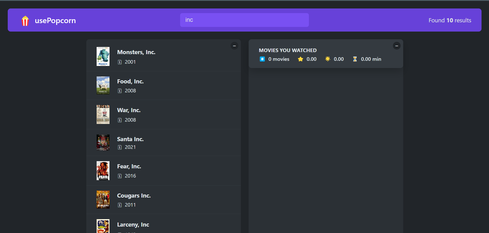
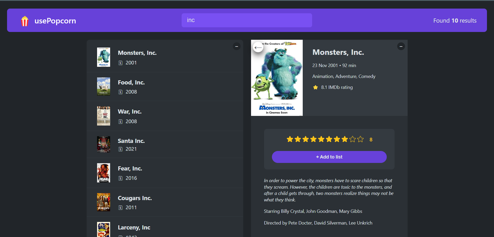
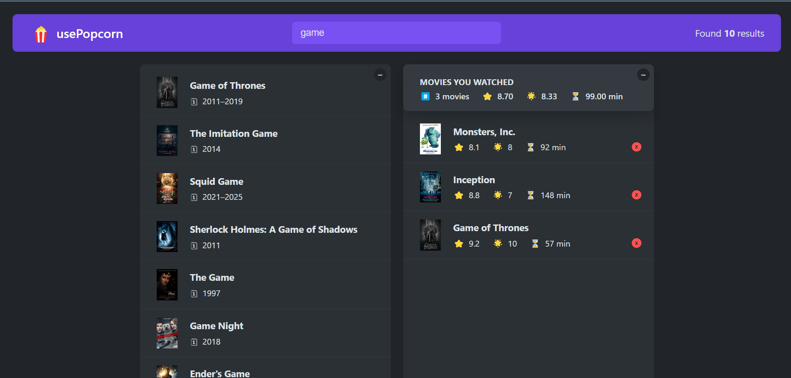

# usePopcorn

🍿 usePopcorn is a React-based movie search and watchlist application. You can search for movies using the OMDb API, view detailed information, and create your own watchlist by adding movies you've watched along with custom ratings.

## Project Description

usePopcorn is a web application that allows users to:
- Search for movies using the OMDb API.
- View a list of movie search results, along with movie details like release year, rating, and genre.
- Add movies to a personal "Watched Movies" list.
- Rate movies with a custom user rating and view average IMDb ratings.
- Persist watched movies in local storage to maintain your watchlist between sessions.

## Technologies Used

- **React**: For building the user interface.
- **Custom Hooks**: For managing API calls, keyboard shortcuts, and local storage.
- **OMDb API**: To fetch movie data.
- **LocalStorage**: To persist the watchlist across sessions.
- **SASS**: For styling the application.
- **Debounce**: To optimize API calls when typing in the search field.

## Usage

1. **Search for a Movie**: Type the title of a movie into the search bar, and results will appear dynamically.

2. **View Details**: Click on a movie to see detailed information, including the plot and IMDb rating.

3. **Add to Watched List**: Once you’ve watched a movie, you can rate it and add it to your personal "Watched" list.

4. **View Watched Summary**: The summary will display average IMDb and personal ratings for your watched movies.

Screenshots
Home Page with Movie Search

Movie Details Page

Watched Movies List

